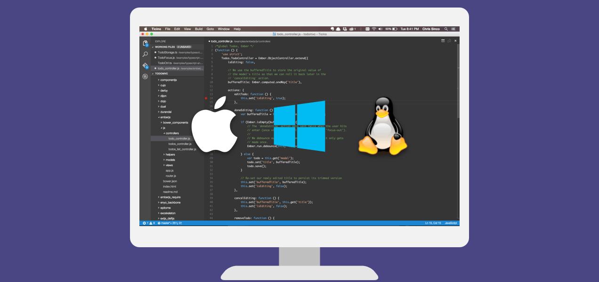

# Visual Studio Code
Visual Studio Code is an open-source code editor for MacOS, Windows and Linux. Visual Studio Code is a simplicit code editor with IntelliSense for code completion and debugging. VSCode has a delightful edit-build-debug cycle, so you don't have to fiddle around as much in your enviroment, which gives you a lot more time porgramming.

VSCode is designed to make coding and debugging easy, and has support for hundreds of different languages.